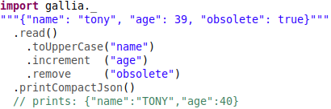

<p align="center"></p>

# Introducing Gallia: a Scala library for data transformation
by <a href="http://anthonycros.com/" target="_blank">Anthony Cros</a> (2021)

<p align="center"></p>

## Introduction

<a name="210121153145"></a>
_Gallia_ is a Scala library for generic data transformation whose main goals are:

1. <a name="210127120327"></a> Practicality
2. <a name="210127120328"></a> Readability
3. <a name="210127120329"></a> Scalability (optionally)

Execution happens in two phases, each traversing a dedicated execution [DAG](https://en.wikipedia.org/wiki/Directed_acyclic_graph):
1. A initial _meta_ phase which ignores the data entirely and ensures that transformation steps are consistent (schema-wise)
2. A subsequent _data_ phase where the data is actually transformed

<a name="210121153146"></a>
<a name="210202173234"></a>
This article is a quick tour that focuses on a few examples rather than a comprehensive guide.
A more thorough discussion of design choices/limitations/direction will come as subsequent article(s).

<a name="210121153202"></a>
Preliminary notes:
- Some links lead to [documentation](http://github.com/galliaproject/gallia-docs) that is still to be written.
- The examples use _JSON_ because of its ubiquity as a notation and despite its [flaws](http://github.com/galliaproject/gallia-docs/blob/init/json.md)

<a name="210121153147"></a><a name="dependencies"></a>
## Dependencies

The library is available for both Scala 2.12 and 2.13 (3.0 will be more [challenging](https://users.scala-lang.org/t/introducing-gallia-a-library-for-data-manipulation/7112/12?u=anthony.cros))

<a name="sbt"></a><a name="210121153201"></a>
Include the following in your `build.sbt` file:
```
libraryDependencies += "io.github.galliaproject" %% "gallia-core" % "0.3.1"
```

<a name="210121153200"></a>
The client code then requires the following import:

```scala
import gallia._
```

<a name="210121153148"></a>
One can also optionally add the following import for general utilities:

```scala
// our open-source utilities library,
//   see https://github.com/aptusproject/aptus-core
import aptus._
```

## Preliminary examples

<a name="shines"></a>
While Gallia shines with (and makes most sense for) complex data processing such as [this one](https://github.com/galliaproject/gallia-dbnsfp#description),
it can also cater to the more trivial cases such as the ones presented below as an introduction.
The same paradigm can therefore handle all (most) of your data manipulation needs.


### Process individual object
```scala
"""{"foo": "hello", "bar": 1, "baz": true, "qux": "world"}"""
  .read() // will infer schema if none is provided

    // uppercase string value for field "foo" ("hello" -> "HELLO")
    .toUpperCase('foo)

    // increment integer value for field "bar" (1 -> 2)
    .increment('bar)

    // remove field "qux" (irrespective of field type)
    .remove('qux)

    // nest (boolean) field "baz" under (new) field "parent"
    .nest('baz).under('parent)

    // flip boolean value of field "baz" (now nested under "parent")
    .flip('parent |> 'baz)

  .printJson()
  // prints: {"foo": "HELLO", "bar": 2, "parent": { "baz": false }}
```

<a name="210121153151"></a>
It is very important to note that the schema is maintained throughout operations, so you will get an error if you try for example to square a boolean:
```scala
"""{"foo": "hello", "bar": 1, "baz": true, "qux": "world"}"""
  .read()
      .toUpperCase('foo)
      .increment  ('bar)
      .remove     ('qux)
      .nest       ('baz).under('parent)
      .square     ('parent |> 'baz ~> 'BAZ) // instead of "flip" earlier
    .printJson()
    // ERROR: TypeMismatch (Boolean, expected Number): 'parent |> 'baz
```

<a name="210121153152"></a>
Notes:
* This error occurs *prior* to the actual data run, and no data is therefore processed
* The error mechanisms works at any level of nesting/multiplicity
* Of course, some errors cannot be caught until the data is actually seen (e.g. IndexOutOfBounds types of checks)

### Process collection of objects
```scala
// INPUT:
//    {"first": "John", "last": "Johnson", "DOB": "1986-02-04", ...}\n
//    {"first": "Kate", ...
"/data/protopeople.jsonl.gz"
  .stream() // vs .read() for single object

    .generate('username).from(_.string('first), _.string('last))
      .using { (f, l) => s"${f.head}${l}".toLowerCase } // -> "jjohnson"
    .toUpperCase('last)
    .fuse('first, 'last).as('name).using(_ + " " + _)
    .transformString('DOB ~> 'age).using(
        _.toLocalDateFromIso.getYear.pipe(2021 - _))

  .write(
    "/tmp/people.jsonl.gz")
    // OUTPUT:
    //  {"username": "jjohnson", "name": "John JOHNSON", "age": 32, ...}\n
    //  {"username": ...
```

<a name="210121153154"></a>
Notes:
- <a href="https://jsonlines.org/" target="_blank">JSONL</a> = one JSON document per line
- This example makes use of:
  - `.pipe()` from `scala.util.chaining`
  - `.toLocalDateFromIso()` from our `import aptus._` above (see [docs](http://github.com/galliaproject/gallia-docs/blob/init/aptus.md))

### Process CSV/TSV files

```scala
"/data/some.tsv.gz"
  .stream()
    .retain('_id, 'age, 'gender)
    .groupBy('age)
  // ...
```

 See more in [inputs](#210120155618) below.

## Basics

### Key referencing
Keys can be referenced as scala's `Symbol`, `String`, `Enumeration`, and `enumeratum.Enum`
```scala
"""{"foo": 1}"""
  .read().rename("foo" ~> 'FOO)
  // OUTPUT: {"FOO":1}

"""{"Very Poor Key Choice  ":
    "please_stop_using_spaces_and_unnecessary_uppercasing_in_keys"}"""
  .read()
    .rename("Very Poor Key Choice  " ~> 'much_better)
    .transformString('much_better).using(_ => "isn't it?")
  // OUTPUT: {"much_better": "isn't it?"}
```

### Path referencing
Paths can be referenced conveniently via the "pipe+greater-than" (`|>`) [notation](http://github.com/galliaproject/gallia-docs/blob/init/tasks.md#t210127123739):
```scala
"""{"parent": {"foo": "value"}}"""
  .read().toUpperCase('parent |> 'foo)
  // OUTPUT: {"parent": {"foo": "VALUE"}}
```

 Note that a _key_ is therefore just a trivial _path_.

### Target selection (keys or paths)
Applicable for both `.read()` and `.stream()` (one vs multiple objects)
```scala
// INPUT: {"foo": "hello", "bar": 1, "baz": true, "qux": "world"}
data.retain(_.firstKey) // {"foo": "hello"}

data.retain(_.allBut('qux))      //{"foo": "hello", "bar": 1, "baz": true}
data.retain(_.customKeys(_.tail))//{"bar": 1, "baz": true, "qux": "world"}

// (overly) complex example:
"""{"k1": "v1", "K2": "v2", "k3": "V3", "K4": "V4", "k5": "v5"}""".read()
  .removeIfValueFor(_.string(_.filterKeys {
      _.startsWith("k") })) // careful not to confuse key selection
    .matches {
      _.startsWith("v") }   // with value selection
  // OUTPUT: {"K2": "v2", "k3": "V3", "K4": "V4"}

// if need a more custom selection
"""{"parent": {"foo": "hello", "bar": 1}}""".read()
    // "leaf" as opposed to "all" (so will exclude 'parent path itself)
    .retain(_.customLeafPaths(_.init))
  // OUTPUT: {"parent": {"foo": "hello"}} since it corresponds
  //   to the "init" of Seq('parent |> 'foo, 'parent |> 'bar)
```

### Generalization of target selection
Likewise applicable for both `.read()` and `.stream()`
```scala
val obj = """{"foo": "hi", "bar": 1, "baz": true, "qux": "you"}""".read()

// can't use "then" (scala) or "thn" (aptus)
obj.forKey    ('foo)      .zen(_ toUpperCase _) // { "foo": "HI", ...
obj.forEachKey('foo)      .zen(_ toUpperCase _)
obj.forEachKey('foo, 'bar).zen(_ toUpperCase _)

obj.forAllKeys((x, k) => x.rename(k).using(_.toUpperCase)) //{"FOO":"hi",..
// ... likewise with forPath, forEachPath, forAllPaths, forLeafPaths, ...
```

### Nested data
```scala
"""{"parent": {"foo": "bar"}}""".read()
  .toUpperCase('parent |> 'foo)
  // OUTPUT: {"parent":{"foo":"BAR"}}
```

### Renaming keys

Renaming can be expressed conveniently via the "tilde+greater-than" (`~>`) [notation](http://github.com/galliaproject/gallia-docs/blob/init/tasks.md#t210127123739) :

```scala
           """{"foo": "bar"}""" .read().rename           ('foo ~> 'FOO)
"""{"parent": {"foo": "bar"}}""".read().rename('parent |> 'foo ~> 'FOO)
// OUTPUT:
//             {"FOO":"bar"}
//   {"parent":{"FOO":"bar"}}
// (respectively)
```

<a name="210128094950"></a>
 A case could be made that `rekey` would be more appropriate than `rename`, but it feels too unnatural.

### Renaming keys _"while-at-it"_

```scala
"""{"foo": 1}""".read()
  .increment('foo ~> 'FOO)
  // OUTPUT: {"FOO":2} - value is incremented and key is uppercased
```

## Single vs Multiple objects

 _Gallia_ does not necessarily expect its elements ("objects") to come in multiples, it is capable of processing them individually.

 Example of going from one to the other, then back:
```scala
"""[{"foo": "bar1"}, {"foo": "bar2"}]""".stream()
  .asArray1        //  {"foo":["bar1","bar2"]}
  .flattenBy('foo) // [{"foo": "bar1"}, {"foo": "bar2"}] (original array)
```

 There are other ways to go back and forth between the two (e.g. [reducing](#210120142925) as shown below, see code for more)

<a name="210121153206"></a>
 Internally, all object-wise operations are actually just an implicit mapping so that the following two expressions are equivalent
```scala
"""[{"foo": "bar1"}, {"foo": "bar2"}]""".stream()      .toUpperCase('foo)
"""[{"foo": "bar1"}, {"foo": "bar2"}]""".stream().map(_.toUpperCase('foo))
```

## DAG Heads

The Head type models a leaf in the DAG(s) that underlies the future execution plan.

Internally, heads comes in as three flavors, each offering a different and relevant subset of operations:
1. _HeadO_: For single object manipulation
2. _HeadS_: For multiple objects manipulation
3. _HeadV[T]_: For _"orphan"_ values manipulation (_HeadV_ is typically not encountered in client code)

Notes:
- _"Orphan"_ values are more conceptually relevant to nested subgraphs, not commonly manipulated by client code. It represents values that are not part of a structured object, e.g the string `"foo"` alone as opposed to the same string `"foo`" within an object `{"key1": 1, "key2": "foo", ...}`.
- The DAGs/heads concepts will be discussed in more details in a future article dedicated to design.

<a name="201118133206"></a>
## SQL-like querying

```scala
people
  // INPUT: [{"name": "John", "age": 20, "city": "Toronto"}, {...

    /* 1. WHERE            */ .filterBy('age).matches(_ < 25)
    /* 2. SELECT           */ .retain('name, 'age)
    /* 3. GROUP BY + COUNT */ .countBy('age)

  // OUTPUT: [{"age": 21, "_count": 10}, {"age": 22, ...
```

<a name="210121153208"></a>
1. _WHERE_ clause: Alternatively as `filterBy(_.int('age)).matches(_ < 25)` if need more than the basic =, <, >, +, ... (see [types](#201118133133))
2. _SELECT_ clause: this would actually be redundant since the subsequent GROUP BY step also retains those fields implicitly
3. _GROUP BY_ + _COUNT_: if unspecified, uses default `_count` output field

<a name="210120142925"></a>
## Reduction
```scala
people.reduceWithMean('age)      // {"age":21.5}
people.reduce('age).wit(_.stdev) // {"age":1.118[...]}
```

<a name="210121153209"></a>
 More powerfully:
```scala
people
  .reduce(
      'age .aggregates(_.mean, _.stdev),
      'city.count_distinct)
  // OUTPUT: {"age":{"_mean":21.5,"_stdev":1.118[...]},"city":3}
```

## Aggregations

```scala
people.group('name).by('city)

// "GROUP all keys but the last key BY that last key"
people
  .group(_.initKeys)
    .by(_.lastKey)
      .as('grouped) // would use '_group if unspecified
  //OUTPUT: [
  // [{"gender":"male","grouped":[{"name":"John","age":21,"city":"Toronto"},
  //     ... ]

// other count types available:
//   distinct, present, missing and distinct+present
people.count('name).by('city)

people.sum  ('age).by('city) // also sum, mean, stdev, ...
people.stats('age).by('city) // descriptive statistics (minimal for now)
  // OUTPUT: [ {"city":"Toronto","_stats":{"mean":21.0, ...
```

<a name="210121153210"></a>
 A more "custom" aggregation (nonsensical):
```scala
people
  .groupBy('city)
  .transformGroupObjectsUsing {
    _.squash(_.string('name), _.int('age))
      // random nonsensical aggregation for demonstration purpose only
      .using(_.map { case (n, a) => n.size + a }.sum) }
  .rename(_group ~> 'awesomeness)
  // OUTPUT:
  //  [{"city":"Toronto"     , "awesomeness":25},
  //   {"city":"Philadelphia", "awesomeness":24},
  //   {"city":"Lyon"        , "awesomeness":53}, ... ]
```

## Pivoting
```scala
people
  .pivot(_.int('age)).usingMean
    .rows   ('city)
    .column ('gender)
      // having to provide those is an unfortunate consequence of
      // maintaining a schema (these values are only known at runtime)
      .asNewKeys('male, 'female)
  // OUTPUT:
  //  [ {"city":"Toronto","male":21},
  //    {"city":"Toronto","female":20},
  //    {"city":"Lyon","male":22.5},     ...]
```

Note that [unpivoting](http://github.com/galliaproject/gallia-docs/blob/init/tasks.md#t210120171258) isn't available, but scheduled

## Renesting Tables

Common prefixes can be leveraged for re-nesting, e.g. "contact_" below:

```scala
// INPUT: "name<TAB>contact_phone<TAB>contact_address<TAB>..."
//                  ^^^^^^^           ^^^^^^^
table
  .renest(_.allKeys)
    .usingSeparator("_")
    // OUTPUT: "{"name":"John", "contact":{"phone": 1234567, "address":..
    //                           ^^^^^^^
```

<a name="210128101227"></a>
This mechanism is not limited to a single level, it can transform keys:

```foo_bar_baz1<TAB>foo_bar_baz2<TAB>...```

into

```{"foo": {"bar": {"baz1": ..., "baz2": ...}}, ...}```

<a name="210121153211"></a>
In practice the renesting operation typically involves a lot more work,
  e.g. if a value is like `"foo1,foo2,foo3"`, it may also need to be split and denormalized on a one-per-row basis.
It is also common to encounter values such as `"John:32|Kate:33|Jean:34"` or combinations of values such as `"John|Kate|Jean"` + `"32|33|34"`
  (the latter two actually sharing the same cardinality of elements pipe-wise).
This alone would deserve its own article, but in the meantime the [DbNsfp](http://github.com/galliaproject/gallia-dbnsfp/blob/init/src/main/scala/galliaexample/dbnsfp/DbNsfp.scala#L14) example highlights a number of interesting such cases.

The opposite operation (_flattening_) is [scheduled](http://github.com/galliaproject/gallia-docs/blob/init/tasks.md#t210131110456) .

## IO

<a name="210120155618"></a>
### Input

`.read()` (single object) and `.stream()` (multiple objects) guess as much about the input format as they can from the input `String` provided:
- JSON markers, e.g. `{`, `[`, ...
- extensions, e.g. `.json`, `.tsv`, `.gz`, ...
- URI schemes, e.g. `file://`, `http://`, `jdbc://`, ..
- ...

We will see later an example of how to override the [default behavior](#210121135434) for reading and writing.

Here are some examples of input consumption:

<a name="210121153212"></a>
```scala
// will infer schema (costly timewise)
"/some/local/file.json" .read  ()
"/some/local/file.jsonl".stream()

// providing schema
"/some/local/file.json" .read  [MyCaseClass]
"/some/local/file.jsonl".stream[MyCaseClass]

// equivalently
"/some/local/file.json" .read  ('foo.string, 'baz.int)
"/some/local/file.jsonl".stream('foo.string, 'baz.int)

       "/some/local/file.jsonl".stream()
"file:///some/local/file.jsonl".stream()

 "http://someserver/test.jsonl".stream()
"https://someserver/test.jsonl".stream()

"ftp://someserver/pub/foo/bar.tsv".stream()

// must make corresponding JDBC driver jar available
"jdbc:myfavdb://localhost:1234/test?user=root&password=root"
  .stream(_.allFrom("TABLE1"))

"jdbc:myfavdb://localhost:1234/test?user=root&password=root"
  .stream(_.query("SELECT * from TABLE1"))

(conn: java.sql.Connection)       .stream(_.sql("SELECT * from TABLE1"))
(ps:   java.sql.PreparedStatement).stream()

// requires gallia-mongodb module and import gallia.mongodb._
//   (see https://github.com/galliaproject/gallia-mongodb)
"mongodb://localhost:27017/test.coll1".stream()
"mongodb://localhost:27017/test"      .stream(_.query("""{"find":"coll1"}"""))
```

#### Tables

Considering the following TSV file:
```bash
$ cat /data/some.tsv | column -nt
f1  f2  f3   f4     f5     f6  f7     f8
z   1   1.1  true   9,8,7  k   d,e,f  T
y   2   2.2  false  6,5,4
```

<a name="210121135434"></a>
 And the following call:
```scala
"/data/some.tsv".stream()

// or its explicit equivalent
"/data/some.tsv".stream(_.tsv.inferSchema)
```

<a name="210121153213"></a>
 The following schema and data will be inferred:
```scala
val schema =
  cls(
      'f1.string,  'f2.int     , 'f3.double, 'f4.boolean, 'f5.ints,
      'f6.string_, 'f7.strings_, 'f8.boolean_)

val data =
 Seq(
  obj('f1 -> "z", 'f2 -> 1, 'f3 -> 1.1, 'f4 -> true , 'f5 -> Seq(9, 8, 7),
        'f6 -> "k", 'f7 -> Seq("d", "e", "f"), 'f8 -> true),
  obj('f1 -> "y", 'f2 -> 2, 'f3 -> 2.2, 'f4 -> false, 'f5 -> Seq(6, 5, 4)))
```

<a name="210121153214"></a>
Note that `_` here stands for `?`, meaning optional. For instance `'f7.strings_` would be represented as `Option[Seq[String]]` in Scala.

<a name="210121153215"></a>
 Additional modules using a similar paradigm could be added in the future, e.g.:
```scala
// NEO4J
"neo4j+s://demo.neo4jlabs.com".stream(
    _.query("""(:Person {name: string})
        -[:ACTED_IN {roles: [string]}]
          ->(:Movie {title: string, released: number})"""))

// Sparql
"http://www.disease-ontology.org?query=".stream(
    _.query("""
      SELECT DISTINCT *
      WHERE {?s <http://www.w3.org/2000/01/rdf-schema#label> "common cold"}
      LIMIT 3"""))

// GraphQL
"https://swapi.com/graphql".stream(
    _.query(
        """{user (id: 1) { firstname } }"""))

// Parquet / Avro / ...
"/data/test.parquet".stream()

// Excel (if sheet contains a single table)
"/data/doc.xlsx".stream(_.allFrom("Some Sheet Name"))

// XML
"/data/doc.xml".stream() // Requires costly schema inferring first

```

 Note: There are proof of concepts for the last two (XML and Excel).

### Output
Output works in a similar fashion, relying on extensions/URI schemes as much as possible

```scala
modifiedPeople.write("/tmp/output/result.tsv")
modifiedPeople.write("/tmp/output/result.jsonl.bz2")

// these are not actually implemented yet (only reading is):
modifiedPeople.write("mongodb://localhost:27017/test.coll1")
modifiedPeople.write(
    uri       = "mongodb://localhost:27017/test",
    container = "coll1")

modifiedPeople.write(
  uri       = "jdbc:myfavdb://localhost:1234/test?user=foo&password=bar",
  container = "SOME_RESULT_TABLE")
```

<a name="scaling"></a>
## Scaling

<a name="spark"></a>
### Spark RDDs

See Apache Spark's <a href="https://spark.apache.org/docs/latest/rdd-programming-guide.html"  target="_blank">RDD documentation</a>.

This module requires

```
libraryDependencies += "org.gallia" %% "gallia-spark" % "0.0.1"
```

And the following import:

```
import gallia.spark._
```

__Abstraction__:

<a name="top-level-multiplicity-abstraction"></a><a name="210224092156"></a>
The main abstraction for top-level multiplicity is [`data.multiple.streamer.Streamer[T]`](https://github.com/galliaproject/gallia-core/blob/init/src/main/scala/gallia/data/multiple/streamer/Streamer.scala#L12), which is then wrapped by the [`data.single.Obj`](https://github.com/galliaproject/gallia-core/blob/init/src/main/scala/gallia/data/single/Obj.scala#L8)-aware counterpart [`data.multiple.Objs`](https://github.com/galliaproject/gallia-core/blob/init/src/main/scala/gallia/data/multiple/Objs.scala#L8) (wraps a `Streamer[Obj]`). It currently comes in three flavors, all also under `data.multiple.streamer`:
1. <a name="210224092157"></a>[`ViewStreamer`](https://github.com/galliaproject/gallia-core/blob/init/src/main/scala/gallia/data/multiple/streamer/ViewStreamer.scala#L12): _default_
2. <a name="210224092158"></a>[`IteratorStreamer`](https://github.com/galliaproject/gallia-core/blob/init/src/main/scala/gallia/data/multiple/streamer/IteratorStreamer.scala#L10): enabled via `.stream(_.iteratorMode)`
3. <a name="210224092159"></a>[`RddStreamer`](https://github.com/galliaproject/gallia-spark/blob/init/src/main/scala/gallia/data/multiple/streamer/RddStreamer.scala#L9): enabled via the `SparkContext` if `gallia.spark._` has been [imported](https://github.com/galliaproject/gallia-core/blob/init/README.md#spark-rdds)

__Example__:

<a name="using-spark"></a><a name="210121153218"></a>
See Spark used in action in [this repo](https://github.com/galliaproject/gallia-genemania-spark/blob/master/README.md#description)

__Bypassing abstraction__:

<a name="210121153221"></a>
You can modify the underlying RDD (think <a href="https://www.joelonsoftware.com/2002/11/11/the-law-of-leaky-abstractions/" target="_blank">Law of Leaky Abstractions</a>) via `.rdd()`, eg:

```scala
data
  // ...
  // can by-pass abstraction when needed,
  //   though schema is not allowed to change
  //   (which cannot be enforced)
  .rdd { _.coalesce(1).cache }
  // ...
```

<a name="spilling"></a><a name="poor-man-scaling"></a><a name="poorman-scaling"></a><a name="210303163034"></a>
### Poor man's scaling (_"spilling"_)

May be useful to your average scientist who may have access to powerful machines (think `qsub`) but not to conveniently provisioned clusters.
Sadly this is a very common occurrence in research settings and the author cares deeply about this problem.

```scala
"/data/huge.tsv.bz2"
  // uses an GNU sort-based approach to sorting/grouping/joining
  .stream(_.iteratorMode)
    .rename('gene).to('hugo_symbol)
    .groupBy('mutation_id).as('genes)
    // ...
```

<a name="210121153224"></a>
Notes:
- <a name="210304140445"></a>All wide transformations can be written in terms of an external sort such as <a href="https://www.gnu.org/software/coreutils/manual/html_node/sort-invocation.html" _target="blank">_GNU sort_</a>
- <a name="210304140446"></a>We can combine such operations and leverage pipes to ensure the execution tree is executed lazily (forking however would benefit from a form of [checkpointing](http://github.com/galliaproject/gallia-docs/blob/init/tasks.md#t210121160956))
- <a name="210304140447"></a>_GNU sort_ is favored for now because replacing it would constitute an significant endeavour, and even then it would be extremely hard to beat performance-wise
- <a name="210304140448"></a>Ideally this would be an alternative run mode for _Spark_ itself
- <a name="210304140450"></a>The current implementation can be seen in action in the [GeneMania processing](https://github.com/galliaproject/gallia-genemania/blob/init/src/main/scala/galliaexample/genemania/GeneMania.scala#L95) sub-project
- <a name="210304140449"></a>This feature is only __partially__ [implemented](http://github.com/galliaproject/gallia-docs/blob/init/tasks.md#t210204111309). It's basically enabled via the `_.stream(_.iteratorMode.[...])` call, and follows this type of invocation paths:
[`Streamer.groupByKey`](./src/main/scala/gallia/data/multiple/streamer/Streamer.scala#L62)
  -> [Iterator's](./src/main/scala/gallia/data/multiple/streamer/IteratorStreamer.scala#L57)
  -> [utility](./src/main/scala/gallia/data/multiple/streamer/IteratorStreamerUtils.scala#L48)
  -> [GNU sort wrapper](./src/main/scala/gallia/data/multiple/streamer/spilling/GnuSortByFirstFieldHack.scala#L15)

<a name="201118133133"></a>
## Types (explicitly)

Let's revisit the [SQL-like](#201118133206) example. Note that the [`Whatever`](http://github.com/galliaproject/gallia-core/blob/init/src/main/scala/gallia/Whatever.scala#L15) type placeholder is being used
(basically an `Any` wrapper that accepts very basic operations such as `+`, `<`, etc.)

```scala
// the following two expressions are equivalent:
//
//          omitting type implies the use of Whatever here  and here
//         v                 v                            v          v
z.fuse(         'first ,          'last ).as('name).using(_  + " " + _)
z.fuse(_.string('first), _.string('last)).as('name).using(_  + " " + _)
//                                                        ^          ^
//                                                         vs strings
```

 A more disciplined and powerful approach than relying on `Whatever` is to be explicit about the type, which gives access to all the type's operations
```scala
z.fuse(_.string('first), _.string('last)).as('name)
   // .head and .toUpperCase require knowledge of the type (String here)
   .using { (f, n) => s"${f.head}${n.toUpperCase}" }
```

More types than the currently [supported](http://github.com/galliaproject/gallia-core/blob/init/src/main/scala/gallia/reflect/BasicType.scala#L16) ones will be added in the [future](http://github.com/galliaproject/gallia-docs/blob/init/tasks.md#t210121124808)

## Schema (metadata)

<a name="schema-aware"></a><a name="210127201457"></a>
_Gallia_ is "schema-aware", meaning it keeps track of schema changes for every step. This allows the library to detect many errors prior to seeing the actual data.

As we've seen before, there are multiple ways to explicitly provide the data's underlying schema.
This saves the library the task of looping over the data first to "infer" said schema.

<a name="210121153230"></a>
 By using a case class
```scala
case class Foo(foo: String, bar: Int, baz: Boolean, qux: String)

"""{"foo": "hello", "bar": 1, "baz": true, "qux": "world"}""".read[Foo]
```

<a name="210121153231"></a>
 By providing it "manually"
```scala
"""{"foo": "hello", "bar": 1, "baz": true, "qux": "world"}"""
  // underscore means optional (since can't conveniently use '?' in Scala)
  .read('foo.string, 'bar.int, 'baz.boolean, 'qux.string, 'corge.string_)
```

<a name="210121153232"></a>
 By providing an external resource that contains a JSON-serialized version of the schema
```scala
"""{"foo": "hello", "bar": 1, "baz": true, "qux": "world"}"""
    .read("/meta/myschema.json")
```

Where "/meta/myschema.json" contains: `{"fields":[{"key":"foo","info":...`

<a name="210121153233"></a>
More interactions with case classes are available (e.g. in transformations); they will be detailed in a future article.

<a name="macros"></a><a name="210326142045"></a>
## Macros

See dedicated [repo](https://github.com/galliaproject/gallia-macros), which contains examples


<a name="full-blown"></a><a name="210121135252"></a>
## Full blown example

I am providing a [link](http://github.com/galliaproject/gallia-dbnsfp/blob/init/src/main/scala/galliaexample/dbnsfp/DbNsfp.scala#L26) to one of the full blow examples I've written using _Gallia_: turning the big
<a href="https://sites.google.com/site/jpopgen/dbNSFP" target="_blank">dbNSFP</a> tables into a corresponding nested structure more conducive to querying (_mongodb_, _elasticsearch_, ...).
See the example [input row](https://github.com/galliaproject/gallia-dbnsfp/blob/init/src/main/scala/galliaexample/dbnsfp/DbNsfpDriver.scala#L19-L20) and example [output object](https://github.com/galliaproject/gallia-dbnsfp/blob/init/src/main/scala/galliaexample/dbnsfp/DbNsfpDriver.scala#L31-L348).

It is in no way complete or 100% correct in its current form, as it is primarily designed to showcase _Gallia_.
I only tested it on a small subset of the data, and I expect unfortunate surprises would arise from processing the entire dataset.

<a name="210121153241"></a>
It showcases among other things how to turn a long `String` full of extractable information, e.g:

```json
"Loss of ubiquitination at K551 (P = 0.0092); Loss of methylation [...]"
```

<a name="210121153242"></a>
Into a more parseable object:
```
[
  {"type":"loss", "change_type":"ubiquitination",
     "location":"K551", "p_value":0.0092 },
  {"type":"loss", "change_type":"methylation",
      ... },
  ...
]
```
<a name="210121153243"></a>
Via an intermediate Scala case class (which contains most of transformation logic):
```scala
// ...
.transformString(top_5_features).using(MutPred.apply)
// ...
```

<a name="210121153244"></a>
Processing this kind of data is exactly why I designed the library in the first place.
I believe a lot of useful knowledge can be unlocked by making this kind of resource more parseable (_DbNsfp_ itself is an incredibly useful resource in terms of content).
The field of bioinformatics in particular is laden with archaic technologies and practices, which in turns
results in tons of lost opportunities for impactful medical discoveries.
I have never dealt with it personally but I imagine the likes of computational physics and other "computational-driven" disciplines probably suffer from similar problems.

<a name="examples"></a><a name="210223093237"></a>
## List of concrete examples
- <a name="210223143334"></a><a name="trivial-examples">Trivial examples:
  - [Word Count](https://gist.github.com/anthony-cros/2ceba1be56bd99a8d4bafd2b9f52b9b3#file-wordcount-scala-L11) example, the "hello world" of big data
  - [Count by word length](https://gist.github.com/anthony-cros/2ceba1be56bd99a8d4bafd2b9f52b9b3#file-wordcount-scala-L29) example
- <a name="210223143709"></a>SQL-like:
  - <a name="210224103624"></a>Northwind queries: coming soon
- <a name="210429153511"></a><a name="web-app-server-logic"></a>Web application server logic:
  - <a name="210429153512"></a><a name="cbio-studies-summary"></a>cbioportal's "_studies summary_" API call: reproducing response to obtain a summary of all studies for [cbioportal](https://www.cbioportal.org/), arguably the most commonly used web portal for cancer data.
  This is the first API call made upon loading the portal's [main page](https://www.cbioportal.org/), and it is specified on their [swagger page](https://www.cbioportal.org/api/swagger-ui.html#/Studies/getAllStudiesUsingGET]).  
    See [dedicated page](https://github.com/galliaproject/gallia-docs/blob/master/examples/cbioportal_cancer_studies.md) for the code.
- <a name="210223094317"></a><a name="articles-examples">Reproducing random examples encountered in articles on data manipulation:
  - <a name="210224103606"></a>TPC-DS Sales summary [example query](https://gist.github.com/anthony-cros/f6d82744523349a65bc86598c79cabdc) as discussed in Andrew Ray's Databricks post: _["Reshaping Data with Pivot in Apache Spark"]((https://databricks.com/blog/2016/02/09/reshaping-data-with-pivot-in-apache-spark.html))_ (February 2016)
  - <a name="210224123645"></a>data [manipulation task](https://gist.github.com/anthony-cros/4b5d40014dd52d57bc7dd05c35029066) for the Cars93 dataset (R MASS package), as discussed in Darren Wilkinson's blog post: _["Data frames and tables in Scala"](https://darrenjw.wordpress.com/2015/08/21/data-frames-and-tables-in-scala/)_ (August 2015)
  - <a name="210224103607"></a>Eurostat census data [example queries](https://gist.github.com/anthony-cros/74811b85f9634f3e5646eed71ad7aa20) as discussed in Mathijs Vogelzang's Medium article: _["Doing cool data science in Java: how 3 DataFrame libraries stack up"]((https://medium.com/@thijser/doing-cool-data-science-in-java-how-3-dataframe-libraries-stack-up-5e6ccb7b437))_ (September 2018)
  - <a name="210224103608"></a>Football premier league data [manipulations](https://gist.github.com/anthony-cros/4a3a9ae9a31881d9fd85c4c67b8a5559) as discussed in Chloe Connor's Towards Data Science article: _["Stop using Pandas and start using Spark with Scala"](https://towardsdatascience.com/stop-using-pandas-and-start-using-spark-with-scala-f7364077c2e0)_ (June 2020)
- <a name="210223094353"><a name="bioinformatics-examples"></a>Bioinformatics examples
  - <a name="clinvar-example">re-processing [clinvar VCF file](https://github.com/galliaproject/gallia-clinvar)
  - <a name="snpeff-example">re-processing [SnpEff output](https://github.com/galliaproject/gallia-snpeff)
  - <a name="dbnsfp-example">re-processing [dbNSFP table](#210121135252) example from section just above
  - <a name="genemania-example">re-processing [GeneMania TSV files](https://github.com/galliaproject/gallia-genemania#README.md); uses the [__poor man's scaling__](#poor-man-scaling) approach (_spilling_)
  - <a name="lovd-example">re-processing [rare disease LOVD data](https://gist.github.com/anthony-cros/1416c544438ef39ca36ae723d02c3ce9) (from [EDS Variant Database](https://databases.lovd.nl/shared/genes/COL3A1))
- <a name="210223095346"></a><a name="physics-examples">Physics examples
  - [ENSDF](https://www.nndc.bnl.gov/ensdf/) data (WIP)
  - WIP (see [forum question](https://www.physicsforums.com/threads/looking-for-large-dataset-of-non-image-centric-physics-data.1000073/))
- <a name="210223094318"></a><a name="spark-examples"></a>Spark-powered:
  - [GeneMania TSV files](https://github.com/galliaproject/gallia-genemania-spark#description) via Spark RDDs
- (more coming soon)

## FAQ

<a name="210127134030"></a>
### Is this ready for production?
Not even remotely. There are known bugs, blatantly missing features, a lot of missing validation, and most importantly it performs rather slowly at the moment.
There is a lot planned in the way of addressing these issues, but it will require more resources than the author working alone. In particular, performance has
a prominent place in the task [list](http://github.com/galliaproject/gallia-docs/blob/init/tasks.md#t210121095401).

<a name="license"></a><a name="bsl"></a><a name="210127134031"></a><a name="210223092122"></a>
### Why the Business Source License (BSL)?

The [terms](https://github.com/galliaproject/gallia-core/blob/master/LICENSE#L9) of the license make Gallia free for any essential OR small entity. For more information, see the [F.A.Q](https://github.com/galliaproject/gallia-docs/blob/master/bsl.md)

<a name="210127134032"></a>
### How can I help?
I'm already aware of many issues and have a long list of [tasks](http://github.com/galliaproject/gallia-docs/blob/init/tasks.md#t210121100050) meant to address them, as well as add the features that are critically missing.
As a result the most useful thing one can do to help at the moment is simply letting me know if this is an effort worth pursuing.
Once a definitive license is chosen, code contributions will be more than welcome.

<a name="210127134033"></a>
### What are the biggest limitations by design?
At this point, a given field can only be of a given type. Ironically this prevents _Gallia_ from having its own metaschema specified in _Gallia_ terms.
See problem in action in the [code](http://github.com/galliaproject/gallia-core/blob/init/src/main/scala/gallia/meta/MetaObj.scala#L35) . A more thorough discussion of design choices and trade-offs/limitations will come in a future article.

Another potential trick is that there can be only one meaning to a missing value. For instance `[{"foo": null}, {"foo": []}, {}]` would all collapse to the same absence of a value: `{}`.
Note that overloading the various `null`/`Nil` mechanisms with alternative meanings is probably not great data modeling practise in the first place.

<a name="210127134034"></a>
### In what way is readability prioritized?
We aim to make the code as readable as possible (goal [#2](#210127120328)) whenever it doesn't affect practicality (goal [#1](#210127120327)).
In particular we want to make it possible for domain experts - who may not be programmers - to understand at least superficially what is happening in each step.
It is obviously not always [feasible](http://github.com/galliaproject/gallia-dbnsfp/blob/init/src/main/scala/galliaexample/dbnsfp/DbNsfp.scala#L224) for the task at hand, but this is otherwise a major goal for the library.

<a name="210127134035"></a>
### What are good use cases for the library?
The main use cases that come to mind at this point are batch ETL, querying, feature engineering, internal application logic, and data validation and evolution.
On the batch ETL front, it would be interesting to see how alternative libraries/languages take examples such as the [dbNSFP](http://github.com/galliaproject/gallia-dbnsfp/blob/init/src/main/scala/galliaexample/dbnsfp/DbNsfp.scala#L14) one above.
In particular, how would the various thresholds (readability/practicality/scalability) be shifted by a different choice.

<a name="210127134036"></a>
### What about features like streaming? EDA? [visualization](http://github.com/galliaproject/gallia-docs/blob/init/tasks.md#t210124092211)? linear algebra? graph queries? notebooks? metadata [semantics](http://github.com/galliaproject/gallia-docs/blob/init/tasks.md#t210124095616) ? squaring the circle?
There are lots of features that could be added in the future, but they all require a pretty sturdy base first.

<a name="210127140116"></a>
Note that the most important part of the library at this point is its client code interface. The internals could be entirely scrapped in the future,
though it's more likely it would be replaced in phases short of a major design flaw.

<a name="why-macros"></a><a name="210127134037"></a>
### Why not more macros-based features?
I [prototyped](#macros) a lot with macros and they will play an important role in the future of _Gallia_.

They can also be tricky to deal with, and since they are scheduled for a major overhaul, I am reluctant to invest a lot of time on that front at the moment.
I see them helping a lot in particular with boilerplate and some compile-time validation (e.g. key [validation](http://github.com/galliaproject/gallia-docs/blob/init/tasks.md#t210127134525)).
The very initial plan was to leverage [whitebox](https://docs.scala-lang.org/overviews/macros/blackbox-whitebox.html) macros for every step, but I gave up on the idea pretty early on. I'd like to re-investigate it for a subset of features/use cases at some point however,
especially since there seems to be some interesting projects (e.g. [quill](https://github.com/getquill/quill)) that already make interesting use of them.

<a name="210127134038"></a>
### Where is the category theory?
I'm quite impressed with the likes of <a href="https://github.com/typelevel/cats" target="_blank">_cats_</a> (-> great [book](https://underscore.io/books/scala-with-cats/)) or
<a href="https://github.com/milessabin/shapeless" target="_blank">_shapeless_</a> but while I find them intellectually fascinating,
I do side with the <a href="https://skillsmatter.com/skillscasts/6483-keynote-scaling-intelligence-moving-ideas-forward" target="_blank">"blue sky"</a> perspective when it comes to prioritizing
<a href="https://gonfva.medium.com/another-scala-is-possible-99bcc6006c7c" target="_blank">practicality</a>.

<a name="210127134039"></a>
### What about other programming languages?
Initially the idea was for this to be a language agnostic DSL for data manipulation, with a reference implementation in Scala basically acting as specification.
It may still become a reality but I'd rather focus on maturing a Scala version first.

<a name="210129170214"></a>
### What is aptus?
"Aptus" is latin for suitable, appropriate, fitting. It is our utility library to help smooth certain pain points of the Java/Scala ecosystem.
It was originally included in _Gallia_ for convenience, but is now externalized in its [own repo](https://github.com/aptusproject/aptus-core) (Apache 2 licensed)

<a name="210127134040"></a><a name="tests"></a>
### Where are the tests?
They live in a different [repo](https://github.com/galliaproject/gallia-testing#gallia-testing) and are being introduced incrementally (unpublished ones need a lot of cleaning up). They basically take the following form:

<a name="210121153250"></a>
```scala
aobj( // the "a" in aobj stands for "Annotated"
    cls('p   .cls_('f.string  , 'g.int ), 'z.boolean))(
    obj('p -> obj ('f -> "foo", 'g -> 1), 'z -> true) )
  .generate('h)
    .from(_.obj('p))
    .using {
        _ .translate('f ~> 'F).using("foo" -> "oof")
          .remove('g) }
  .check {
    aobj(
      cls('p   .cls_('f.string, 'g.int   ), 'z.boolean, 'h .cls_ ('F.string)))(
      obj('p -> obj ('f -> "foo", 'g -> 1), 'z -> true, 'h -> obj('F -> "oof")) ) }
```

Where `check` wraps an equality assertion. I have not settled on a definitive [testing library](https://github.com/galliaproject/gallia-docs/blob/master/tasks.md#testing-library) yet, though considering utest at this point.

<a name="210127134041"></a>
### Why so few comments, especially scaladoc?
I try to leverage the language constructs as much as possible, e.g. by naming variables and methods so they convey semantics as much as possible.
I then add the occasional comment when I deem it necessary, but overall expect any contributor to be sufficiently familiar with Scala to understand what's going on.
As the project matures, proper scaladoc-friendly comments can hopefully be [added](http://github.com/galliaproject/gallia-docs/blob/init/quotes.md#mvp) as well.

<a name="210127134042"></a>
### Why does the [terminology](http://github.com/galliaproject/gallia-docs/blob/init/tasks.md#t210124100007) sometimes sound funny or full-on neological?
Naming things is hard. Sometimes I give up and favor an alternative until a better idea comes along. Sometimes a [temporary](http://github.com/galliaproject/gallia-core/blob/init/src/main/scala/gallia/heads/HeadU.scala#L8) name just sticks around, by way of organic growth.
More generally I'd like to create an OWL [ontology](http://github.com/galliaproject/gallia-docs/blob/init/tasks.md#t210127124029) to more formally define terms that may deserve it.

<a name="210127134043"></a>
### What's with the IDs that look like timestamps and pop up everywhere (e.g. `210121162536`)?
They're my quick-and-dirty mechanism for ID-ing elements, and are generated by combining the `date` command along with `xautomation`, called via `xbindkeys` keyboard shortcuts.
When they represent a task, it allows me to ID the task temporarily. Many small tasks will never see an actual issue tracking system ID assigned to them.
Note that the timestamp itself is never guaranteed to be meaningful, as I occasionally hack them around (for consolidation purposes for instance).

<a name="210127134044"></a>
### Where does the name "Gallia" come from?
_Gallia_ is the name of a Romano-Gallic [goddess](https://en.wikipedia.org/wiki/Gallia_%28goddess%29). It is also the latin name for [Gaul](https://en.wikipedia.org/wiki/Gaul), the area the author is originally from.

Rumor has it that the goddess Gallia appeared in 16 BCE to a group of data engineers gathered at a local tavern in Lugdunum (now [Lyon](https://www.google.com/maps/place/Lyon,+France)),
and that she told them to keepeth their code (1) _practical_, (2) _readable_, and (3) _scalable_ (if needed), in that exact order.

## Contact & Announcements

- Contact: <sub></sub>
- [Twitter (@AnthonyCros)](https://twitter.com/anthony_cros) - for further announcements
- [Linked In](https://www.linkedin.com/in/anthony-cros-3587b063/)
- [Blog](http://anthonycros.com/)

See original announcement on the [Scala Users list](https://users.scala-lang.org/t/introducing-gallia-a-library-for-data-manipulation/7112)

<p align="center"></p>
